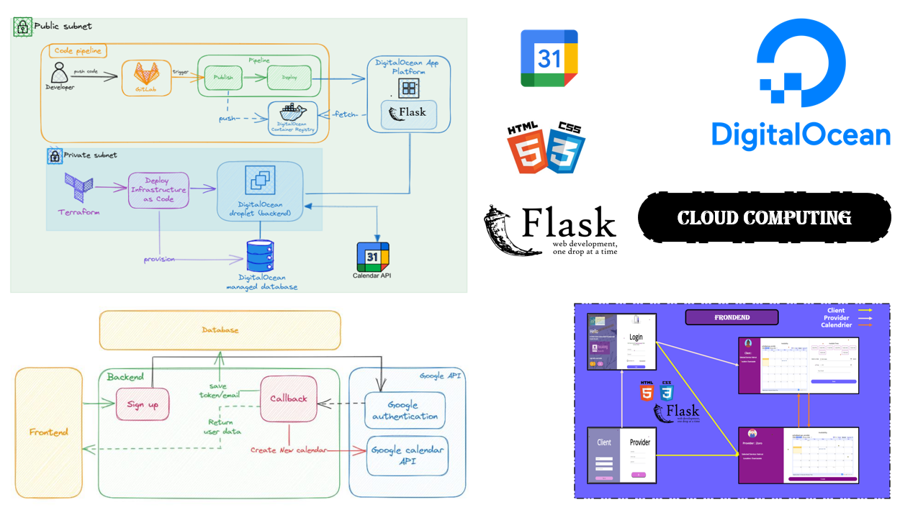
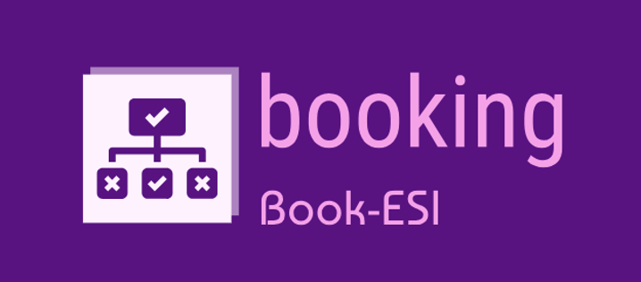
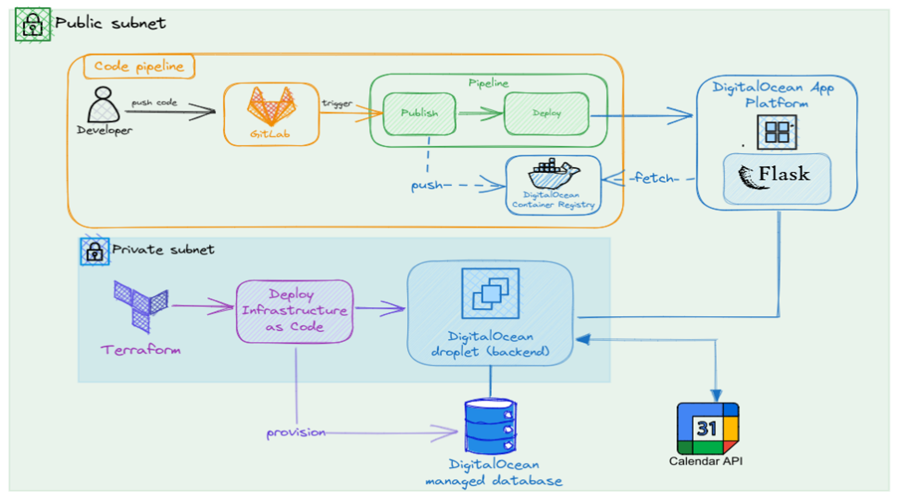
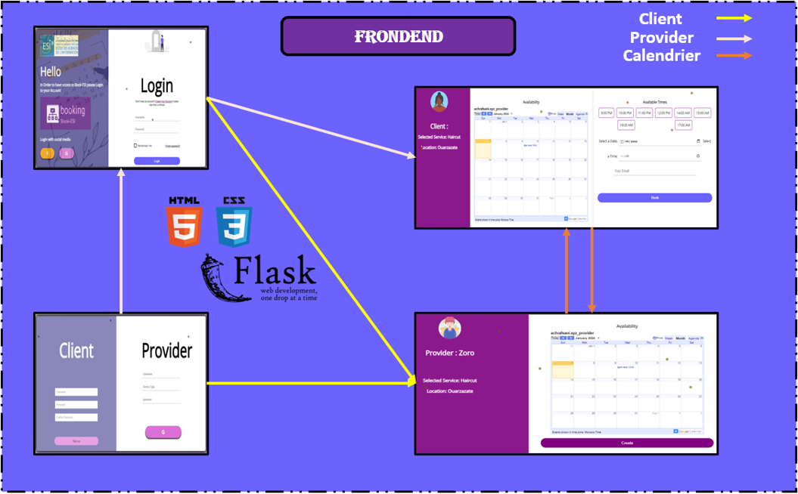
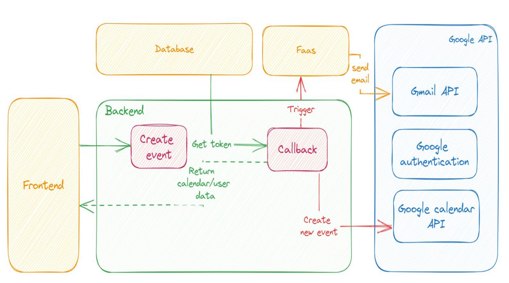

<ul >
    <li>ELGHAZI Soufiane</li>
</ul>

 

<h1 style='color:#4c4893' align='center'>
    Cloud-Computing :
</h1>
<h2 style='color:purple' align='center'>
    Book-ESI : Système de réservation en ligne pour petites entreprises
</h2>

Check out the demo video :

 

Imaginez un monde où les clients n'ont plus à faire la queue pendant des heures pour accéder aux services dont ils ont besoin. Dans notre société moderne, le temps est devenu une ressource précieuse, et les consommateurs recherchent activement des moyens d'optimiser leur emploi du temps. Les longues attentes pour obtenir un service ou un rendez-vous peuvent être source de frustration et d'inconfort, décourageant parfois les clients potentiels,Dans de ce projet, nous plongerons dans les fonctionnalités de notre application, mettant en 
lumière comment elle simplifie le processus de réservation, augmente l'efficacité opérationnelle des prestataires, et offre une expérience utilisateur fluide.

 

<h3 style="color:#4c4893">Solution Proposé :</h3>

    

Notre application Book-ESI permet de faire faces à ces problèmes là en offrant aux petites entreprises n'ayant ni les moyens financiers ni l'expertise nécessaire pour développer leurs propres plateformes, une solution pour créer facilement une instance pour leur service à travers notre application, intégrant un calendrier convivial pour gérer les disponibilités. Cela donne aux clients la liberté de réserver leur créneau préféré sans quitter le confort de leur domicile.  

 

<h3 style="color:#4c4893">Justification du Choix des Technologies</h3>

Dans le paysage en rapide évolution du développement logiciel, la nécessité d'un déploiement rapide, fiable et évolutif est primordiale. Le projet en question a été conçu pour répondre à ces exigences en tirant parti d'un ensemble de technologies éprouvées, tout en maintenant la flexibilité nécessaire pour s'adapter aux changements futurs.

<h4 style="color:purple;font-weight:bold">* DigitalOcean</h4>

DigitalOcean est un cloud provider qui offre une plateforme simplifiée mais puissante. On l’a choisi principalement car on peut avoir un crédit de $200 en se connectant avec le compte étudiant de GitHub.

Son App Platform permet un déploiement direct depuis des conteneurs Docker, ce qui aligne parfaitement avec notre utilisation de Docker pour le développement local et l'intégration continue. De plus, DigitalOcean fournit des services de bases de données gérées, ce qui diminue la charge opérationnelle en éliminant la nécessité de gérer manuellement la base de données. La combinaison de l'App Platform et des bases de données gérées de DigitalOcean permet de se concentrer davantage sur le développement de l'application plutôt que sur la gestion de l'infrastructure.

<h4 style="color:purple;font-weight:bold">* Flask</h4>

Flask est un micro-framework web pour Python qui est à la fois léger et flexible. Il permet de construire des applications web de manière rapide et avec une grande liberté concernant les choix d'architecture. Pour notre application, la simplicité et la rapidité de développement offertes par Flask étaient parfaites pour créer une API RESTful bien structurée. De plus, Flask s'intègre facilement avec d'autres extensions et outils, ce qui le rend idéal pour les projets souhaitant conserver une base de code épurée et extensible.

<h4 style="color:purple;font-weight:bold">* Docker</h4>

L'utilisation de Docker s'inscrit dans la stratégie de containerisation, un élément clé des bonnes pratiques DevOps actuelles. Docker encapsule l'application et son environnement, garantissant ainsi une cohérence entre les environnements de développement, de test et de production. Cela élimine l'antique problème du "Ça fonctionne sur ma machine", en permettant à l'application de fonctionner dans des conteneurs immuables qui sont isolés et reproduisibles. Docker facilite également la mise à l'échelle horizontale et l'orchestration des services, deux caractéristiques essentielles pour les applications modernes.

<h4 style="color:purple;font-weight:bold">* Terraform</h4>

Pour automatiser et maintenir l'infrastructure de manière déclarative, Terraform a été choisi pour sa capacité à décrire l'infrastructure comme code. Cela permet une collaboration améliorée, des mises à jour claires de l'infrastructure et une intégration directe avec DigitalOcean. En outre, Terraform offre la possibilité d'étendre et de modifier l'infrastructure avec un contrôle et une précision accrue, sans être lié à un seul fournisseur cloud.

<h4 style="color:purple;font-weight:bold">* GitLab: CI/CD</h4>

GitLab CI/CD a été sélectionné pour sa riche intégration avec le dépôt GitLab et pour sa facilité à configurer des pipelines d'intégration et de déploiement continus. Avec GitLab CI/CD, nous pouvons automatiser les tests, la construction des images Docker et le déploiement avec des retours rapides sur chaque commit. La capacité de GitLab à fournir des environnements de review et de staging avant le déploiement en production est également un atout majeur.

 

Architecture:

    

 

Frontend:

    

 

Backend:

    

 

 ✨ THE END ✨
 
